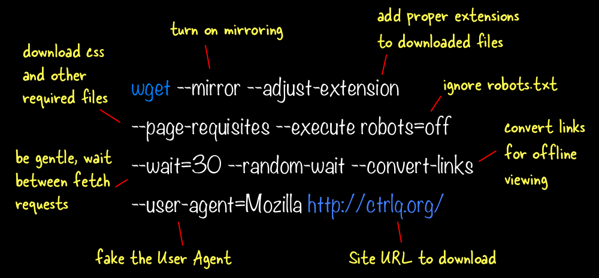

翻译自[All the Wget Commands You Should Know](http://www.labnol.org/software/wget-command-examples/28750/)

如何下载整个网站用来离线浏览？怎样将一个网站上的所有MP3文件保存到本地的一个目录中？怎么才能将需要登陆的网页后面的文件下载下来？怎样构建一个迷你版的Google？

[Wget](https://www.gnu.org/software/wget/manual/html_node/Overview.html)是一个自由的工具，可在包括[Mac](http://brew.sh/)，Window和Linux在内的多个平台上使用，它可帮助你实现所有上述任务，而且还有更多的功能。与大多数下载管理器不同的是，wget可跟着网页上的HTTP链接，递归地下载相关的文件。有个士兵就用过[这个工具](http://www.wired.com/2011/12/cables-scripts-manning/)来从美军内网上下载数千个机密文件，并发布到了维基解密上。

wget下载得到整个网站的镜像

# 使用Wget扒行网站----20个实用例子

Wget是一个极为强大的工具，但和大部分其它命令行程序一样，它所支持的大量选项会吓跑新的用户。因而，这里我们会列出一些wget命令，以帮助你完成一些普通的任务，包括下载单个文件和对整个网站做备份，等。你如果有时间通读[wget手册](https://www.gnu.org/software/wget/manual/wget.pdf)，自然会大受裨益。但是对于忙碌的人们来说，这里给出的却是随时可执行的命令。

  1) 从网上下载单个文件

    wget http://example.com/file.iso

  2) 下载一个文件，但以不同的名字存为本地文件

    wget --output-document=filename.html example.com

  3) 下载一个文件，存到指定的目录

    wget --directory-prefix=folder/subfolder example.com

  4) 恢复之前中断的一个wget下载

    wget --continue example.com/big.file.iso
    wget -c example.com/big.file.iso

  5) 下载一个文件，但只在服务器上的版本比本地版本新时才会真正执行

    wget --continue --timestamping wordpress.org/latest.zip

  6) 用wget下载多个网址，这些网址存于一个文本文件中，一行一个网址

    wget --input list-of-file-urls.txt

  7) 从服务器下载一些以连续序号为文件名的文件

    wget http://example.com/images/{1..20}.jpg
    wget http://example.com/images/pre-{1..20}-post.jpg

  8) 下载一个网页，包括它所有的内容，比如样式表和包含的图片，它们是确保网页离线显示所必需的

    wget -page-requisites --span-hosts --convert-links --adjust-extension http://example.com/dir/file
    wget -p -H -k -E http://example.com/dir/file

# 用Wget对网站进行镜像备份

  9) 下载整个网站，包括它所有链接的页面和文件

    wget --execute robots=off --recursive --no-parent --continue --no-clobber http://example.com/
    wget -e robots=off -r -np -c -nc http://example.com/

  10) 从网站上一个子目录中下载所有MP3文件

    wget --level=1 --recursive --no-parent --accept mp3,MP3 http://example.com/mp3/
    wget -l 1 -r -np -A mp3,MP3 http://example.com/mp3/

  11) 将一个网站上的所有图片下载到同一个目录中

    wget --directory-prefix=files/pictures --no-directories --recursive --no-clobber --accept jpg,gif,png,jpeg http://example.com/images/
    wget -P files/pictures -nd -r -nc -A jpg,gif,png,jpeg http://example.com/images/

  12) 从一个网站上下载PDF文件，采用递归的方式，但不跳出指定的网域

    wget --mirror --domains=abc.com,files.abc.com,docs.abc.com --accept=pdf http://abc.com/
    wget -m -D abc.com,files.abc.com,docs.abc.com -A pdf http://abc.com/

  13) 从一个网站上下载所有文件，但是排除某些目录

    wget --recursive --no-clobber --no-parent --exclude-directories /forums,/support http://example.com
    wget -r -nc -np -X /forums,/support http://example.com

# 用Wget下载受限内容

Wget可用于下载网站上登陆页面之后的内容，或避开HTTP参照位址(referer)和User Agent字符串对抓屏的限制。

  14) 下载网站上的文件，假设此网站检查User Agent和HTTP参照位址(referer)

    wget --referer=/5.0 --user-agent="Firefox/4.0.1" http://nytimes.com

  15) 从密码保护网站上下载文件

    wget --http-user=labnol --http-password=hello123 http://example.com/secret/file.zip

  16) 抓取登陆界面后面的页面。你需要将用户名和密码替换成实际的表格域值，而URL应该指向(实际的)表格提交页面

    wget --cookies=on --save-cookies cookies.txt --keep-session-cookies --post-data 'user=labnol&password=123' http://example.com/login.php
    wget --cookies=on --load-cookies cookies.txt --keep-session-cookies http://example.com/paywall

# 用wget获得文件细节

  17) 在不下载的情况下，得到一个文件的大小 (在网络响应中寻找用字节表示的文件长度)

    wget --spider --server-response http://example.com/file.iso
    wget --spider -S http://example.com/file.iso

  18) 下载一个文件，但不存储为本地文件，而是在屏幕上显示其内容
    
    wget --output-document=- --quiet google.com/humans.txt
	wget -O- -q google.com/humans.txt

  19) 得到网页的最后修改日期 (检查HTTP头中的Last Modified标签)

    wget --server-response --spider http://www.labnol.org/
    wget -S --spider http://www.labnol.org/

  20) 检查你的网站上的链接是否都可用。spider选项将令wget不会在本地保存网页

    wget --output-file=logfile.txt --recursive --spider http://example.com
    wget -O logfile.txt -r --spider http://example.com

另见[Essential Linux Commands](http://www.labnol.org/software/linux-commands/19028/)

## wget ---- 如何对服务器友好一些？

wget工具本质上是一个抓取网页的网络爬虫，但有些网站主机通过`robots.txt`文件来屏幕这些网络爬虫。另外，对于使用了[`rel-nofollow`]()属性的网页，wget也不会扒取它的链接。

不过，你可以强迫wget忽略`robots.txt'和nofollow指令，只需在所有wget命令行中加上`--execute robots=off`选项即可。如果一个网页主机通过查看User Agent字段来屏幕wget请求，你也总是可以用`--user-agent=Mozilla`选项来伪装成火狐浏览器。

wget命令会增加网站服务器的负担，因为它不断地追踪链接，并下载文件。因而，一个好的网页抓取工具应该限制下载速度，而且还要在连接的抓取请求之间设置一个停顿，以缓解服务器的负担。

    wget --limit-rate=20k --wait=60 --random-wait --mirror example.com

在上面的示例中，我们将下载带宽限制在了20KB/s，而且wget会在任意位置随机停顿30s至90s时间，然后再开始下一次下载请求。

最后是一个小测试，你认为下列wget命令是干什么用的？

    wget --span-hosts --level=inf --recursive dmoz.org

